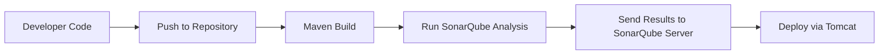

# 🚀 SonarQube by KK FUNDA

---

## 🌍 Flow Overview: Before Maven & Tomcat → SonarQube



* **SonarQube sits between development and deployment** to ensure only high-quality code is pushed forward.

---

## 🔍 What is SonarQube?

> SonarQube is an **open-source platform** for **continuous inspection** of code quality.

* Performs **static code analysis** to identify:

  * Bugs
  * Vulnerabilities
  * Code Smells

---

## 📊 Key Features

### 🛡️ Code Quality & Security

* ✉ **Bugs & Vulnerabilities**: Prevent potential production issues
* ⚡ **Code Smells**: Improve maintainability
* 📈 **Code Coverage**: Check test coverage
* ♻️ **Duplication**: Reduce redundant code
* ⏳ **Technical Debt**: Estimate effort to improve codebase

### 📚 Multi-Language Support

> Java, JavaScript, Python, C#, C++, PHP, and many more

### 🏛 Quality Gates

* Define pass/fail criteria based on coverage, duplication, and critical issues

---

## 📄 Similar Tools to SonarQube

| Static Analysis      | Purpose                                   | Popularity     |
| -------------------- | ----------------------------------------- | -------------- |
| Checkmarx            | Security vulnerabilities in source code   | 🔥 Very High   |
| Coverity             | Detect defects across C, C++, Java, etc.  | 🔥 High        |
| Fortify SCA          | Security-focused static analysis          | 🔥 High        |
| Veracode             | Cloud-based static/dynamic code analysis  | 🔥 High        |
| Semmle LGTM (GitHub) | Semantic code queries to find deep issues | 🌟 Medium-High |
| Codacy               | Automated code quality review             | 🌟 Medium      |

| Linters & Style Checkers | Purpose                                       | Popularity   |
| ------------------------ | --------------------------------------------- | ------------ |
| PMD                      | Finds unused variables, empty catch blocks    | 🌟 Medium    |
| ESLint                   | JavaScript linter to find and fix code issues | 🔥 Very High |
| StyleCop                 | Enforces C# coding styles                     | 🌟 Medium    |
| Pylint / Flake8          | Python static code analysis                   | 🔥 High      |
| Rubocop / Brakeman       | Ruby style and security issues                | 🌟 Medium    |
| ReSharper, Infer         | .NET & Java analysis tools                    | 🌟 Medium    |

### ✅ When to Use What?

* **SonarQube**: General-purpose, project-wide code quality and security.
* **Checkmarx / Fortify / Veracode**: Enterprise security audits.
* **Coverity / LGTM**: Large codebases needing deep static analysis.
* **ESLint / Pylint / Rubocop**: For development-time linting and formatting.
* **Codacy / CodeClimate**: Quick integration into GitHub with visual dashboards.

### 🌟 Benefits Over SonarQube

* **Checkmarx & Fortify**: Deeper security analysis (esp. OWASP Top 10)
* **Veracode**: Scalable SaaS, ideal for remote teams
* **LGTM**: GitHub-native analysis with query capabilities
* **PMD, ESLint, Pylint**: Lightweight, fast local checks for devs

### 🧩 Real-Time Use Cases

* Checkmarx: Pre-production security checks in fintech
* Coverity: Automotive firmware scanning
* ESLint: JavaScript style enforcement in front-end apps
* Codacy: Dashboard for small startups tracking quality in real-time

---

## 📝 Code Review vs. Code Coverage

| Category | Code Review                            | Code Coverage                |
| -------- | -------------------------------------- | ---------------------------- |
| Method   | Manual peer review                     | Automated via test execution |
| Goal     | Ensure quality, readability, standards | Check which lines are tested |
| Benefits | Fewer bugs, better practices           | Identify untested paths      |
| Tools    | GitHub PRs, Bitbucket                  | JaCoCo, Istanbul, Clover     |

---

## 🧰 SonarQube Introduction

* **Type**: Continuous Code Quality Tool
* **Vendor**: Sonar
* **License**: Open source (for most languages)
* **Version**: 9.x
* **Platform**: Cross-Platform (Linux, macOS, Windows)
* **Installer**: ZIP package (not executable)

[Download SonarQube ⬇️](https://www.sonarsource.com/products/sonarqube/downloads/)

---

## 📚 Detailed Info

* Originally named **Sonar**
* Supports multiple languages & databases
* Produces **HTML/PDF reports**
* Integrates with multiple browsers
* Detects:

  1. Duplicate Code
  2. Standards Violations
  3. Unit Test Gaps
  4. Complex Code
  5. Poor Commenting
  6. Potential Bugs

> ⚠️ SonarQube can block deployments based on report failures

---

## 🚀 Prerequisites for Installation

### Hardware ⚙️

* CPU: Multi-core
* RAM: Min 2GB (Recommended: 4GB)
* Disk: 1GB+ free

### Software 🌐

* **OS**: Linux (preferred), Windows, macOS
* **Java**: JDK 11 or 17 *(set JAVA\_HOME)*
* **DB**: PostgreSQL, Oracle, SQL Server *(MySQL deprecated)*
* **Optional**: H2 embedded DB for testing

---

## 🛠️ SonarQube Installation Guide

1. **Launch EC2 (t2.medium)**
2. **Connect via SSH**
3. **Switch to root**

   ```bash
   sudo su -
   ```
4. **Install Java**

   ```bash
   sudo yum install java-11-openjdk-devel -y
   javac --version
   ```
5. **Navigate to /opt**

   ```bash
   cd /opt
   ```
6. **Install Utilities**

   ```bash
   yum install wget unzip -y
   ```
7. **Download SonarQube**

   ```bash
   wget https://binaries.sonarsource.com/Distribution/sonarqube/sonarqube-9.6.1.59531.zip
   unzip sonarqube-9.6.1.59531.zip
   mv sonarqube-9.6.1.59531 sonarqube
   ```
8. **Create Non-root Sonar User**

   ```bash
   useradd sonar
   visudo
   # Add: sonar   ALL=(ALL) NOPASSWD: ALL
   ```
9. **Change Permissions**

   ```bash
   chown -R sonar:sonar /opt/sonarqube/
   chmod -R 775 /opt/sonarqube/
   su - sonar
   cd /opt/sonarqube/bin/linux-x86-64/
   ```
10. **Manage SonarQube**

    ```bash
    sh sonar.sh start | status | stop | restart
    ```
11. **Access Web UI**

    * URL: `http://<your-ip>:9000`
    * Port: `9000` (Allow in security group)
12. **Login**

    * Username: `admin`
    * Password: `admin` (Change on first login)

---

## ⚠️ Troubleshooting Tips

* Use **sonar** user to start service
* Ensure **port 9000** is open
* Check **Java installation**
* Use machine with **4GB RAM** minimum

---

## 🏁 Real-time Use Cases

* ✅ Enforcing quality gates in CI/CD pipelines (e.g. Jenkins, GitHub Actions)
* 🔐 Security auditing for OWASP top 10 vulnerabilities
* 💡 Dev teams checking for tech debt in agile sprints
* 📊 Weekly reporting of code health to stakeholders
* 🚧 Preventing deployments when code doesn’t meet standards

> ⭐ With SonarQube integrated, your CI/CD pipelines gain a powerful guard against bad code. Automate quality checks and build confidence in every release.
